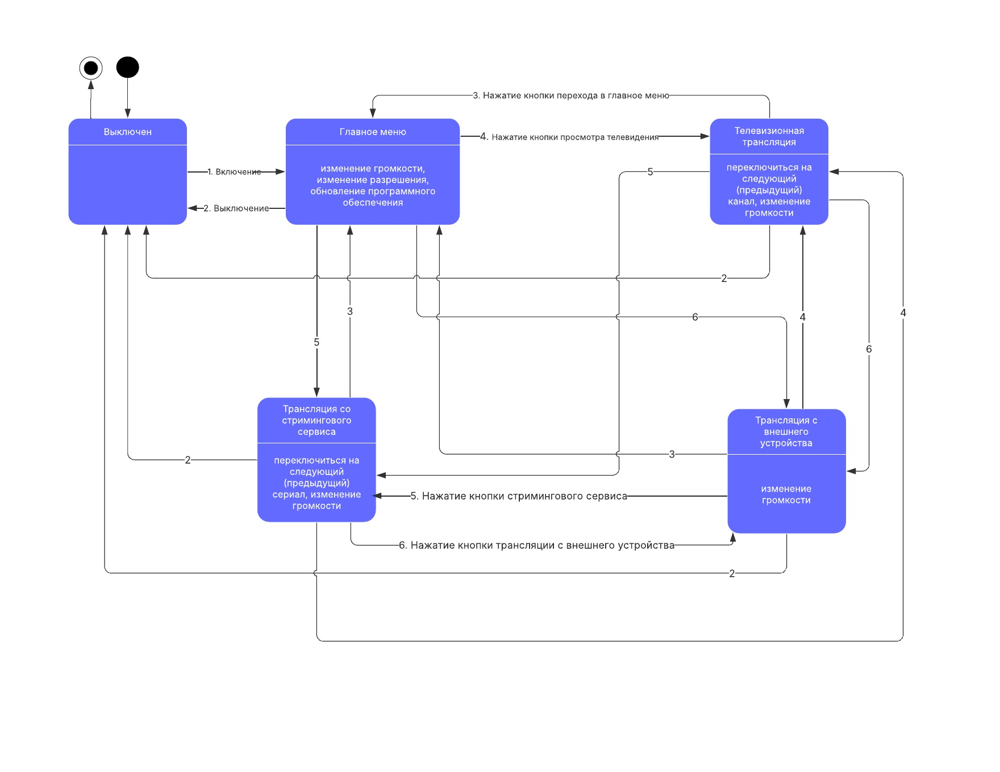

# Television Model

Модель телевизора 64

Предметная область: электроника и телевизионные технологии.

Важные сущности: телевизор, пульт дистанционного управления, экран, звуковая система, технические характеристики.

Операции: операция включения и выключения, операция выбора телеканала, операция настройки изображения и звука, операция подключения внешних устройств, операция обновления программного обеспечения.

# Состояния системы

Для модели телевизора выделим следующие состояния: выключен, главное меню, просмотр телеканалов, просмотр стриминга, трансляция с внешних устройств.

Пользователь будет взаимодействовать с телевизором посредством пульта.
В состоянии, когда телевизор выключен нажатие любых кнопок на пульте, кроме включения, никак не отражается на состоянии системы. Из выключенного состояния
система может переходить только в состояние главного меню.

В состоянии главного меню пользователь может изменять громкость и разрешение, обновлять программное обеспечение, переходить в любое другое состояние.

В состоянии просмотра телевидения пользователь может изменять громкость, переключаться на следующий (предыдущий) телеканал, переходить в любое другое состояние.

В состоянии просмотра стриминга система работает по аналогии с состоянием просмотра телевидения, но при этом происходит переключение не телеканалов, а контента, предоставляемого
стриминговым сервисом.

В состоянии трансляции со стороннего устройства пользователь может изменять громкость и переходить в любое другое состояние.



# Разделение на проекты

```
│   .gitattributes
│   .gitignore
│   README.md
│   TelevisionModel.sln
│
├───Images
│       UmlStateDiagram.jpg
│
├───TelevisionModel # проект, описывающий модель системы независимо от способа взаимодействия с пользователем
│   │   Television.cs
│   │   TelevisionModel.csproj
│   │
│   ├───Content
│   │       ChannelBroadcastingSystem.cs
│   │       IContentProvider.cs
│   │       SignalTransmitter.cs
│   │       StreamingService.cs
│   │       TelevisionChannel.cs
│   │       TelevisionSeries.cs
│   │
│   ├───Data # исходные данные для работы программы (при сборке копируются в выходной каталог)
│   │       logo_paths.json # телевизионные каналы
│   │       Resources.Designer.cs
│   │       Resources.resx # ресурсы для модели телевизора (например, сообщения исключений), в этом месте добавляется локализация
│   │       tv_shows.json # сериалы для стримингового сервиса
│   │
│   ├───Devices
│   │       Device.cs
│   │       RemoteControl.cs
│   │
│   ├───TelevisionStates
│   │       ExternalDeviceScreencastState.cs
│   │       ITelevisionState.cs
│   │       MainMenuState.cs
│   │       StreamingState.cs
│   │       TelevisionBroadcastingState.cs
│   │       TurnedOffState.cs
│   │       TurnedOnStateBase.cs
│   │
│   ├───TelevisionSubsystems
│   │       Screen.cs
│   │       Software.cs
│   │       SoundSystem.cs
│   │
│   └───Utils
│           ActionResult.cs
│           Saver.cs
│           States.cs
│           TechnicalSpecifications.cs
│
├───TelevisionModelConsole # консольный интерфейс для модели
│   │   CommandLineInterface.cs
│   │   ConsoleMessages.Designer.cs
│   │   ConsoleMessages.resx
│   │   Program.cs
│   │   TelevisionModelConsole.csproj
│
├───TelevisionModelTests # тесты модели
│   │   MSTestSettings.cs
│   │   SignalTransmitterTests.cs
│   │   TelevisionModelTests.csproj
│   │   TelevisionTests.cs
│
```

# Основные сущности

## Состояния

### 1. Интерфейс ITelevisionState

Описывает методы, которые должны реализовывать классы состояний системы.

- Метод для переключения на следующий канал предоставителя контента:
```c#
public ActionResult SwitchToNextChannel(IContentProvider contentProvider);
```


- Метод для переключения на предыдущий канал предоставителя контента:
```c#
public ActionResult SwitchToPreviousChannel(IContentProvider contentProvider);
```


- Метод для изменения громкости:
```c#
public ActionResult EditVolume(SoundSystem soundSystem, double newVolume);
```

- Метод для изменения разрешения экрана:
```c#
public ActionResult ChangeResolution(Screen screen, int newResolutionX, int newResolutionY);
```

- Метод для обновления программного обеспечения:
```c#
public ActionResult UpdateSoftware(Software software, string newSoftwareVersion);
```

- Метод для переключения в состояние главного меню:
```c#
public ActionResult SwitchToMainMenuState(Television television);
```

- Метод для выключения:
```c#
public ActionResult SwitchToTurnedOffState(Television television);
```

- Метод для переключения в состояние просмотра телеканалов:
```c#
public ActionResult SwitchToTelevisionBroadcastingState(Television television);
```

- Метод для переключения в состояние просмотра стримингового сервиса:
```c#
public ActionResult SwitchToStreamingState(Television television);
```

- Метод для переключения в состояние трансляции экрана с внешнего устройства:
```c#
public ActionResult SwitchToExternalDeviceScreencastState(Television television, Device externalDevice);
```

Данный интерфейс реализуется классами:
- TurnedOffState - для описания выключенного состояния
- TurnedOnStateBase - абстрактный класс для обобщения всех остальных состояний
- - MainMenuState - для описания состояния главного меню
- - TelevisionBroadcastingState - для описания состояния просмотра телеканалов
- - StreamingState - для описания состояния просмотра стриминга
- - ExternalDeviceScreencastState - для описания состояния трансляции с внешних устройств

## Сущности, предоставляющие информацию для системы

### 2. Интерфейс IContentProvider

Описывает взаимодействие телевизора с системой предоставления контента.

- Метод для переключения на следующее содержимое:
```c#
public ActionResult SwitchToNext();
```

- Метод для переключения на предыдущее содержимое:
```c#
public ActionResult SwitchToPrevious();
```

Данный интерфейс реализуется классами:
- ChannelBroadcastingSystem
- StreamingService

### 3. ChannelBroadcastingSystem

Класс для просмотра телевидения

- Свойство для хранения индекса выбранного канала:
```c#
public int SelectedChannelIndex { get; private set; }
```

- Список доступных каналов:
```c#
private List<TelevisionChannel> AvailableChannels { get; }
```

- Конструктор для инициализации без параметров:
```c#
public ChannelBroadcastingSystem()
```

- Конструктор с заранее известным индексом выбранного канала:
```c#
public ChannelBroadcastingSystem(int selectedChannelIndex) : this()
```

- Метод для переключения на следующий канал:
```c#
public ActionResult SwitchToNext()
```

- Метод для переключения на предыдущий канал:
```c#
public ActionResult SwitchToPrevious()
```

- Метод для генерации первичной информации для пользователя про список доступных каналов:
```c#
public ActionResult Greet()
```

### 4. StreamingService

Класс для взаимодействия со стриминговым сервисом.

- Свойство для хранения индекса выбранного сериала:
```c#
public int SelectedIndex { get; private set; }
```

- Список доступных сериалов:
```c#
private List<TelevisionSeries> Series { get; }
```

- Конструктор для инициализации без параметров:
```c#
public StreamingService()
```

- Конструктор с заранее известным индексом выбранного сериала:
```c#
public StreamingService(int selectedIndex) : this()
```

- Метод для переключения на следующий сериал:
```c#
public ActionResult SwitchToNext()
```

- Метод для переключения на предыдущий сериал:
```c#
public ActionResult SwitchToPrevious()
```

- Метод для генерации первичной информации для пользователя про список доступных сериалов:
```c#
public ActionResult Greet()
```


### 5. TelevisionChannel

Класс, описывающий телевизионный канал.

- Свойство для хранения имени данного телеканала:
```c#
public string Name { get; }
```

- Свойство для хранения относительного пути к изображению с логотипом канала:
```c#
private string LogoPath { get; }
```

- Конструктор для инициализации телевизионного канала:
```c#
public TelevisionChannel(string logoPath, string name)
```

- Метод для преобразования телевизионного канала в строку:
```c#
public override string ToString()
```

- Метод для построения полного пути к файлу с изображением:
```c#
public string BuildLogoUrl()
```

### 6. TelevisionSeries

Класс, описывающий телевизионный сериал.

- Свойство для хранения имени данного сериала:
```c#
public string Name { get; set; }
```

- Свойство для хранения пути к веб-странице с информацией про данный сериал:
```c#
public string Url { get; set; }
```

- Свойство для хранения пути к изображению с постером для данного сериала:
```c#
public string ImageUrl { get; set; }
```

- Свойство для хранения краткого описания данного сериала:
```c#
public string Summary { get; set; }
```

- Конструктор (основной конструктор) для инициализации телевизионного канала:
```c#
public class TelevisionSeries(string name, string url, string imageUrl, string summary)
```

- Метод для преобразования телевизионного сериала в строку:
```c#
public override string ToString()
```

### Resources (автоматически сгенерированный)

Класс для управления различными ресурсами, в данном случае используется для хранения различных сообщений системы. Позволяет в дальнейшем быстро добавить локализацию для любого языка.

## Устройства

### 7. Device

Базовый класс для любого устройства.

- Свойство для хранения имени данного устройства:
```c#
public string Name { get; }
```

- Конструктор для установки значения имени данного устройства:
```c#
public Device(string name)
```

### 8. RemoteControl

Класс пульта управления телевизором.

- Свойство для хранения телевизора, подписанного на данный пульт управления:
```c#
private Television PairedTelevision { get; set; }
```

В данном классе объявлены следующие делегаты для описания различных событий, которые могут произойти во время взаимодействия пользователя с пультом управления:

- Делегат для обыкновенной кнопки:
```c#
public delegate ActionResult ZeroArgumentsButton();
```

- Делегат для элемента управления на пульте, способного задавать новое разрешение:
```c#
public delegate ActionResult ChangeResolutionButton(int newResolutionX, int newResolutionY);
```

- Делегат для выбора новой версии программного обеспечения для обновления:
```c#
public delegate ActionResult UpdateSoftwareButton(string newSoftwareVersion);
```

- Делегат для подключения внешних устройств:
```c#
public delegate ActionResult ExternalDeviceScreencastButton(Device externalDevice);
```

- Делегат для изменения громкости:
```c#
public delegate ActionResult EditVolumeButton(double newVolume);
```

Экземпляры делегатов:

- Кнопка включения (выключения):
```c#
public ZeroArgumentsButton? PowerSwitchButtonPushed;
```

- Кнопка перехода на следующий канал:
```c#
public ZeroArgumentsButton? NextChannelButtonPushed;
```

- Кнопка перехода на предыдущий канал:
```c#
public ZeroArgumentsButton? PreviousChannelButtonPushed;
```

- Кнопка изменения громкости:
```c#
public EditVolumeButton? EditVolumeButtonPushed;
```

- Кнопка изменения разрешения:
```c#
public ChangeResolutionButton? ChangeResolutionButtonPushed;
```

- Кнопка обновления программного обеспечения:
```c#
public UpdateSoftwareButton? UpdateSoftwareButtonPushed;
```

- Кнопка просмотра телевидения:
```c#
public ZeroArgumentsButton? TelevisionBroadcastingButtonPushed;
```

- Кнопка просмотра стримингового сервиса:
```c#
public ZeroArgumentsButton? StreamingButtonPushed;
```

- Кнопка перехода в главное меню:
```c#
public ZeroArgumentsButton? MainMenuButtonPushed;
```

- Кнопка трансляции с внешних устройств:
```c#
public ExternalDeviceScreencastButton? ExternalDeviceScreencastButtonPushed;
```

- Конструктор для инициализации пульта управления:
```c#
public RemoteControl(Television televisionToPair, string name = "") : base(name)
```

- Связывание пульта с телевизором:
```c#
public void Pair(Television televisionToPair)
```

- Метод для нажатия на кнопку включения:
```c#
public ActionResult? PowerSwitch()
```

- Метод для нажатия на кнопку перехода на следующий канал:
```c#
public ActionResult? NextChannel()
```

- Метод для нажатия на кнопку перехода на предыдущий канал:
```c#
public ActionResult? PreviousChannel()
```

- Метод для нажатия на кнопку изменения громкости:
```c#
public ActionResult? EditVolume(double newVolume)
```

- Метод для нажатия на кнопку изменения разрешения:
```c#
public ActionResult? ChangeResolution(int newResolutionX, int newResolutionY)
```

- Метод для нажатия на кнопку обновления программного обеспечения:
```c#
public ActionResult? UpdateSoftware(string newSoftwareVersion)
```

- Метод для нажатия на кнопку телевизионной трансляции:
```c#
public ActionResult? TelevisionBroadcasting()
```

- Метод для нажатия на кнопку просмотра стримингового сервиса:
```c#
public ActionResult? Streaming()
```

- Метод для нажатия на кнопку перехода в главное меню:
```c#
public ActionResult? MainMenu()
```

- Метод для нажатия на кнопку трансляции с внешних устройств:
```c#
public ActionResult? ExternalDeviceScreencast(Device externalDevice)
```

## Подсистемы телевизора:

### 9. Screen

Класс, описывающий подсистему экрана.

- Свойство для хранения текущего разрешения экрана по горизонтали:
```c#
public int ResolutionX { get; private set; }
```

- Свойство для хранения текущего разрешения экрана по вертикали:
```c#
public int ResolutionX { get; private set; }
```

- Свойство для хранения текущего разрешения экрана по горизонтали:
```c#
private int MaxResolutionX { get; }
```

- Свойство для хранения текущего разрешения экрана по вертикали:
```c#
private int MaxResolutionY { get; }
```

- Свойство для хранения типа матрицы экрана:
```c#
private string MatrixType { get; }
```

- Свойство для хранения высоты экрана:
```c#
private double Height { get; }
```

- Свойство для хранения ширины экрана:
```c#
private double Width { get; }
```

- Конструктор для экрана:
```c#
public Screen(int maxResolutionX, int maxResolutionY, string matrixType, double height, double width)
```

- Метод для изменения разрешения экрана:
```c#
public void ChangeResolution(int newResolutionX, int newResolutionY)
```

### 10. Software

- Свойство для хранения установленной версии программного обеспечения:
```c#
public string InstalledVersion { get; private set; }
```

- Конструктор для программного обеспечения:
```c#
public Software(string installedVersion = "0.0")
```

- Метод для обновления версии программного обеспечения:
```c#
public void UpdateSoftware(string newVersion)
```

### 11. Sound system

- Свойство для хранения значения текущей громкости:
```c#
public double Volume { get; private set; }
```

- Свойство для хранения значения мощности звуковой системы:
```c#
public double Power { get; }
```

- Свойство, определяющее, равна ли громкость 0:
```c#
public bool IsMuted { get; private set; }
```

- Конструктор для звуковой системы:
```c#
public SoundSystem(double power)
```

- Метод для изменения громкости:
```c#
public void EditVolume(double newVolume)
```

## Другие сущности

### 12. ActionResult

Обёртка для возвращаемых значений.

- Свойство для списка деталей сообщения:
```c#
public List<string> MessageDetails { get; private set; }
```

- Свойство для описания сообщения:
```c#
private string MessageDescription { get; set; } 
```

- Метод для перевода объекта в строку:
```c#
public override string ToString();
```

- Метод для добавления технических спецификаций к системе:
```c#
public ActionResult AddSpecifications(TechnicalSpecifications technicalSpecifications)
```

### 13. Saver

Статический класс для сохранения и загрузки состояния системы.

- Метод для сохранения технических спецификаций телевизора в файл:
```c#
public static void SaveToFile(Television television)
```

- Метод для создания телевизора на основе сохранённых данных:
```c#
public static Television TryLoadFromFile()
```

### 13. TechnicalSpecifications

Класс для хранения технических характеристик системы.

- Свойство для сохранения состояния:
```c#
public States State { get; set; }
```

- Свойство для сохранения разрешения по горизонтали:
```c#
public int ResolutionX { get; set; }
```

- Свойство для сохранения разрешения по вертикали:
```c#
public int ResolutionY { get; set; }
```

- Свойство для сохранения громкости:
```c#
public double CurrentVolume { get; set; }
```

- Свойство для сохранения версии программного обеспечения:
```c#
public string SoftwareVersion { get; set; } 
```

- Свойство для сохранения индекса выбранного телеканала:
```c#
public int SelectedChannelIndex { get; set; }
```

- Свойство для сохранения индекса выбранного сериала:
```c#
public int SelectedTelevisionSeriesIndex { get; set; } 
```

- Конструкторы для инициализации технических характеристик:
```c#
public TechnicalSpecifications()

public TechnicalSpecifications(States state, Screen screen, SoundSystem soundSystem, Software software,
            ChannelBroadcastingSystem channelBroadcastingSystem, StreamingService streamingService)
```

- Метод для перевода технических характеристик в строку:
```c#
public override string ToString() 
```

- Метод для перевода технических характеристик в строку в формате json:
```c#
public string ToJson() 
```

- Метод для обновления технических характеристик:
```c#
public void Update(States state, Screen screen, SoundSystem soundSystem, Software software,
     ChannelBroadcastingSystem channelBroadcastingSystem, StreamingService streamingService)
```

## 14. Television

Главный класс в модели, который управляет всеми подсистемами и реагирует на взаимодействие пользователя с пультом.

- Свойство для подсистемы просмотра телеканалов:
```c#
public ChannelBroadcastingSystem CurrentChannelBroadcastingSystem { get; }
```

- Свойство для стримингового сервиса:
```c#
public StreamingService StreamingService { get; }
```

- Свойство для текущего состояния системы:
```c#
public ITelevisionState CurrentState { get; set; }
```

- Свойство для текущего источника содержимого:
```c#
public IContentProvider ContentProvider { get; set; }
```

- Свойство для сохранения состояния в технических характеристиках:
```c#
public States State { get; set; }
```

- Свойство для технических характеристик:
```c#
public TechnicalSpecifications Specifications { get; private set; }
```

- Свойство для звуковой подсистемы:
```c#
private SoundSystem SoundSystem { get; }
```

- Свойство для подсистемы экрана:
```c#
private Screen Screen { get; }
```

- Свойство для подсистемы программного обеспечения:
```c#
private Software Software { get; }
```

- Конструкторы для телевизора:
```c#
public Television(SoundSystem soundSystem, Screen screen)
    
public Television(SoundSystem soundSystem, Screen screen, Software software, ChannelBroadcastingSystem channelBroadcastingSystem, 
            StreamingService streamingService, States state)
```

- Метод для подсистемы для подписывания на события пульта:
```c#
public void RegisterRemoteControl(RemoteControl remoteControl)
```

- Метод для подсистемы для отписывания на события пульта:
```c#
public void UnregisterRemoteControl(RemoteControl remoteControl)
```

- Метод для загрузки сохранённого состояния системы:
```c#
private void ReloadState(States state)
```

- Метод для выключения:
```c#
private ActionResult TurnOff()
```

- Метод для включения:
```c#
private ActionResult TurnOn()
```

- Метод для обработки нажатия кнопки питания на пульте:
```c#
private ActionResult PowerSwitchPushed()
```

- Метод для переключения на следующий канал (сериал):
```c#
private ActionResult SwitchToNextChannel()
```

- Метод для переключения на предыдущий канал (сериал):
```c#
private ActionResult SwitchToPreviousChannel()
```

- Метод для изменения громкости системы:
```c#
private ActionResult EditVolume(double newVolume)
```

- Метод для изменения разрешения:
```c#
private ActionResult ChangeResolution(int newResolutionX, int newResolutionY)
```

- Метод для обновления программного обеспечения:
```c#
private ActionResult UpdateSoftware(string newSoftwareVersion)
```

- Метод для перехода в главное меню:
```c#
private ActionResult SwitchToMainMenuState()
```

- Метод для перехода в состояние просмотра телевидения:
```c#
private ActionResult SwitchToTelevisionBroadcastingState()
```

- Метод для перехода в состояние просмотра стриминга:
```c#
private ActionResult SwitchToStreamingState()
```

- Метод для перехода в состояние трансляции с внешнего устройства:
```c#
private ActionResult SwitchToExternalDeviceScreencastState(Device externalDevice)
```

- Метод для обновления технических спецификаций системы:
```c#
private string UpdateTechnicalSpecifications()
```


